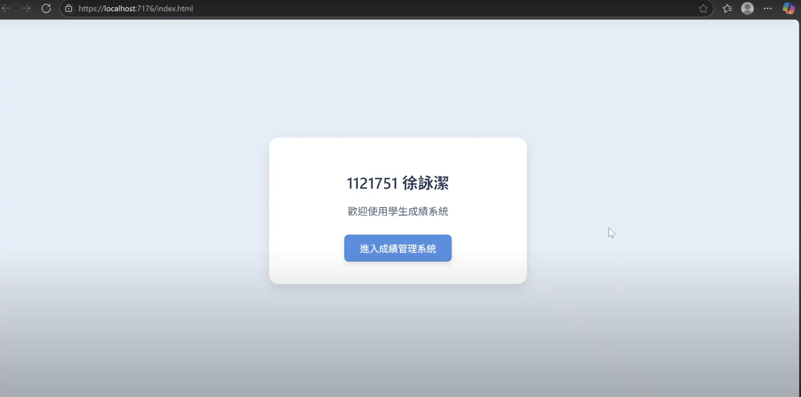
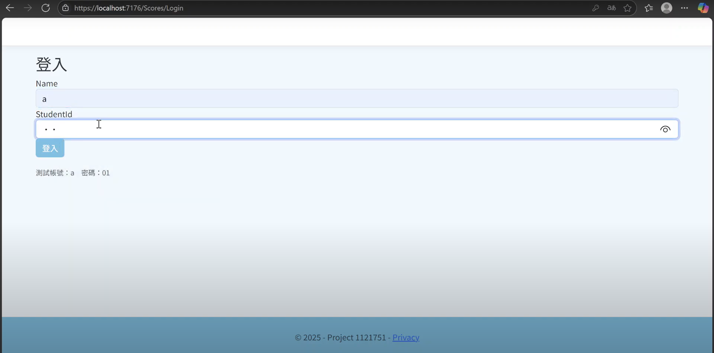
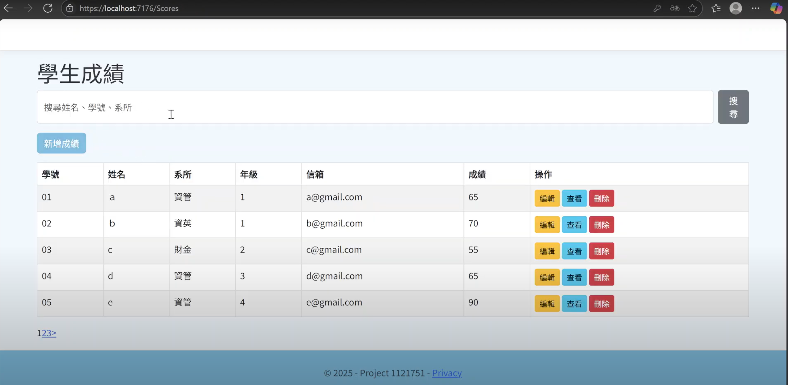

# MVC 專案

## 專案簡介

本專案以 ASP.NET MVC 架構開發，實作一個具備登入與資料庫連線的「學生成績管理系統」。
登入後可查看伺服器端資料庫中的學生資料，並進行新增、編輯、刪除、搜尋與分頁操作。
主要目的在於熟悉 MVC 架構整合、資料庫操作（CRUD），以及基礎網頁互動介面的設計。

專案實際操作影片，可點選下方連結。

[](https://youtu.be/GXlx5FMvFis)

---

## 專案功能與內容

- **首頁 (`index.html`)**：網站入口與主題導覽。


- **登入系統**：使用者需輸入帳號密碼登入，驗證成功後進入主頁面（伺服器端驗證）。


- **資料顯示**：以表格呈現學生資料與成績，支援排序與分頁（每頁顯示 5 筆資料）。  


- **新增資料**：透過表單新增學生資料並寫入資料庫。 


- **新增資料**：透過表單新增學生資料並寫入資料庫。 


- **編輯資料**：修改現有學生資料並更新資料庫內容。 


- **刪除資料**：可刪除指定學生資料。


- **搜尋功能**：可依姓名、學號等關鍵字查詢符合條件的資料。


---

## 使用技術
- **HTML、CSS、Bootstrap、Razor View**：建立頁面結構與表單介面，實作搜尋與分頁效果。
- **ASP.NET MVC (C#)**：控制流程、登入驗證、處理資料 CRUD 邏輯。
- **SQL Server**：儲存學生資料與使用者帳密，專案連線至老師伺服器端資料庫。
- **Visual Studio 2022**：建置專案、撰寫控制器與模型、偵錯與執行系統。  

---

## 專案執行方式

開啟 Visual Studio，選擇「開啟專案或方案」。

匯入專案資料夾（Project/）。

在 Web.config 檔中確認連線字串 (Connection String) 設定正確。

按下 Ctrl + F5 執行專案。

系統開啟登入頁面 → 輸入帳號密碼登入。

---

## 專案結構
```
 Project/
 ├─ Controllers/
 │   ├─ HomeController.cs        # 登入與首頁控制
 │   ├─ StudentController.cs     # 學生成績 CRUD 控制
 │
 ├─ Models/
 │   ├─ Student.cs               # 學生資料模型 (Model)
 │   ├─ User.cs                  # 使用者登入資料模型
 │
 ├─ Views/
 │   ├─ Home/
 │   │   └─ Login.cshtml         # 登入頁面
 │   ├─ Student/
 │   │   ├─ Index.cshtml         # 主頁面 (資料表 + 分頁)
 │   │   ├─ Create.cshtml        # 新增資料頁
 │   │   ├─ Edit.cshtml          # 編輯資料頁
 │   │   └─ Details.cshtml       # 檢視資料頁
 │
 ├─ Scripts/                     # 前端互動腳本 (搜尋、分頁)
 ├─ Content/                     # CSS 樣式與 Bootstrap 檔案
 ├─ Web.config                   # 系統與資料庫設定
 └─ README.md

```
---

## 授權說明
本專案僅供學術用途與作品展示使用。  
若需引用或修改，請標明出處。
